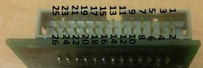
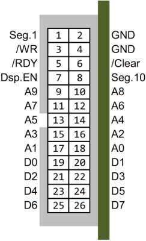
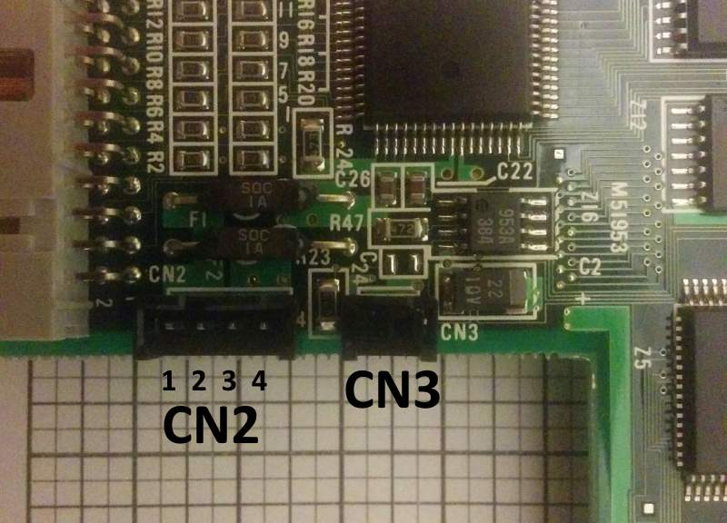
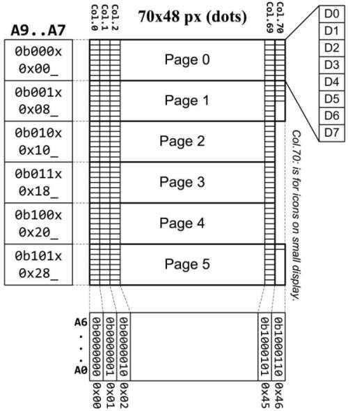
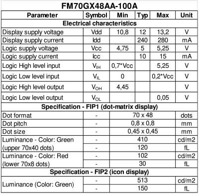

# Datasheet
Original files I found on some German AVR forum, don't remember where....
But those are in bad quality, so I cooked up, a more beautiful version :D

# FM70GX48VFD-100A

## Overwrite

This is a VFD display with two lamps. Small lamp contains only symbols, while big one is a dot-matrix with 2 colors.
Upper part is green (40px hight), while lower part is red (8px height).

Display have a 10-bit wide parallel address bus, and 8-bit wide data bus. The 3 MSB bits selects page (8px height row), and 7 LSB bits select column. The 70th column from pages: 0, 1 and 5 is used for controlling icon on smaller display.

## Connectors

### CN1 - Address & Data
Grey connector is Address & Bus:



And the Pinout:

Signal|Pin|-|Pin|Signal
------|---|-|---|------
Seg.1 | 1 |-| 2 |GND
/WR|3|-|4|GND
/RDY|5|-|6|/Clear
Dsp.EN|7|-|8|Seg.10
A9|9|-|10|A8
A7|11|-|12|A6
A5|13|-|14|A4
A3|15|-|16|A2
A1|17|-|18|A0
D0|19|-|20|D1
D2|21|-|22|D3
D4|23|-|24|D5
D6|25|-|26|D7



### CN2 - Power
Here is a CN2 & CN3 layout:



And CN2 pinout:

Pin|Function
---|--------
1|+5V
2|+12V
3|GND
4|GND

### CN3 - Brightness
CN3 is for brightness control. Use 100k potentiometer to control brightness or just leave the jumper (full brightness).

## Memory mapping

The dot-matrix display have resolution: 
* 70px width (70 columns)
* 48px height (48/8bit = 5 pages)

Only Pages: **0** , **1** and **5** have available 71st column (```0bxxx1000110```), which is mapped to to icons on smaller display.

Here is the memory map with addressing:



The smaller display have those icons:


**The bar** is located at **Page0**, **Column 71** , 
and this is how bits in Pages 1 & 5 from column 71st are mapped to icons:

Address|Page|Column|Bit|Segment|Description
-|-|-|-|-|-
```0x046```|1|70|0|Seg.11|top bar on accu
```0x046```|1|70|1|Seg.12|mid-top bar on accu
```0x046```|1|70|2|Seg.13|mid-bottom bar on accu
```0x046```|1|70|3|Seg.14|bottom bar on accu
```0x2C6```|5|70|0|Seg.15|Accu frame

Two left icons are controlled by digital IOs:

CN1 Pin #|Icon/Pin name|Description
-|-|-
1|Seg.1|Plug icon
8|Seg.10|Drop icon

## Electrical and optical spec.



# All-in-One
I have created a one-page-file (PDF) for reference:

[FM70GX48AA-100A compiled info (PDF File)](FM70GX48_MemMapPinout.pdf)

And the PDF in PNG version:

[FM70GX48AA-100A compiled info (PNG imange)](FM70GX48_MemMapPinout.png)


# Credists

* Someone from German forum for publishing scans of documentations :smile:
* Me - for compiling this for U :smile: