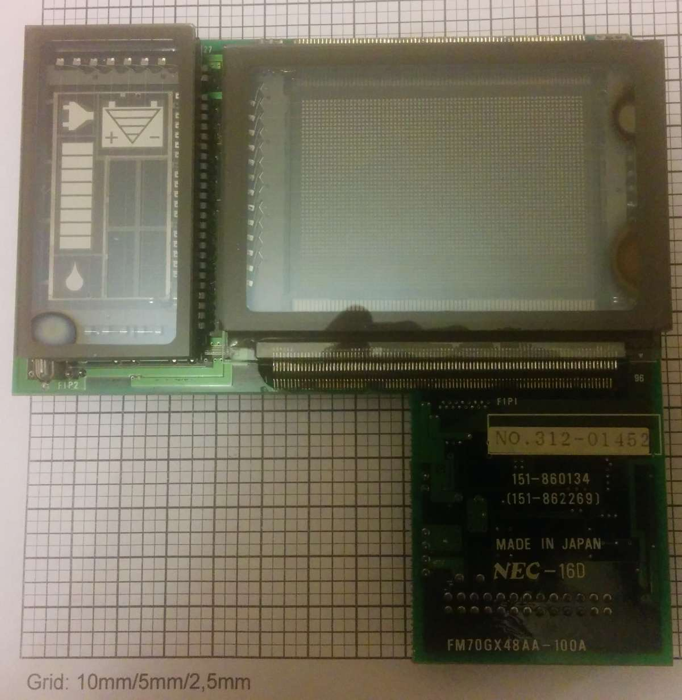
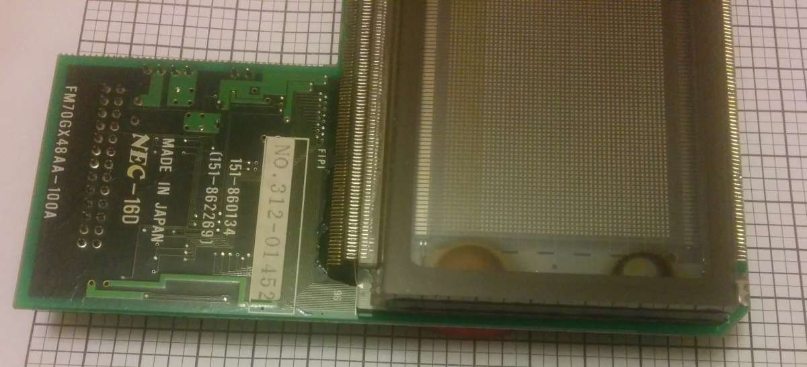
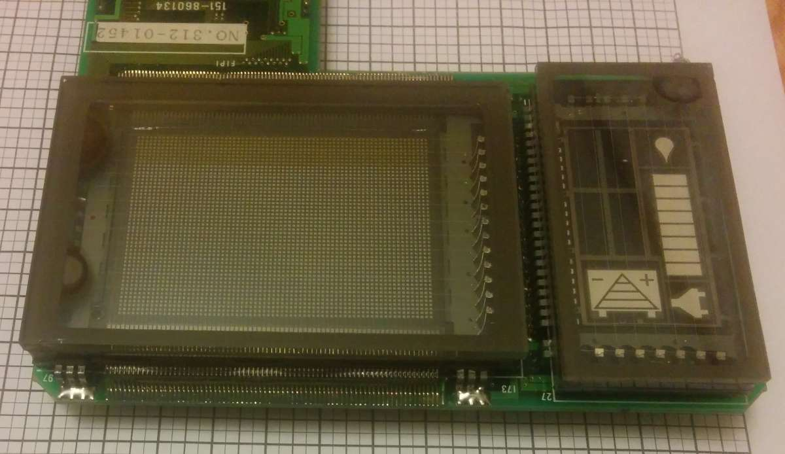
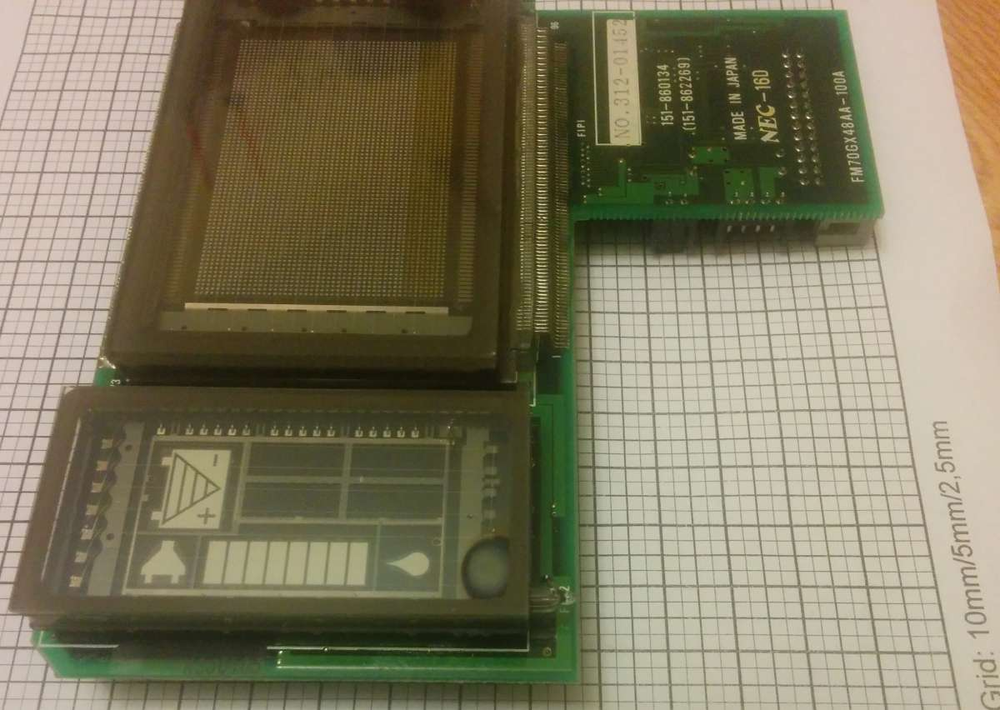
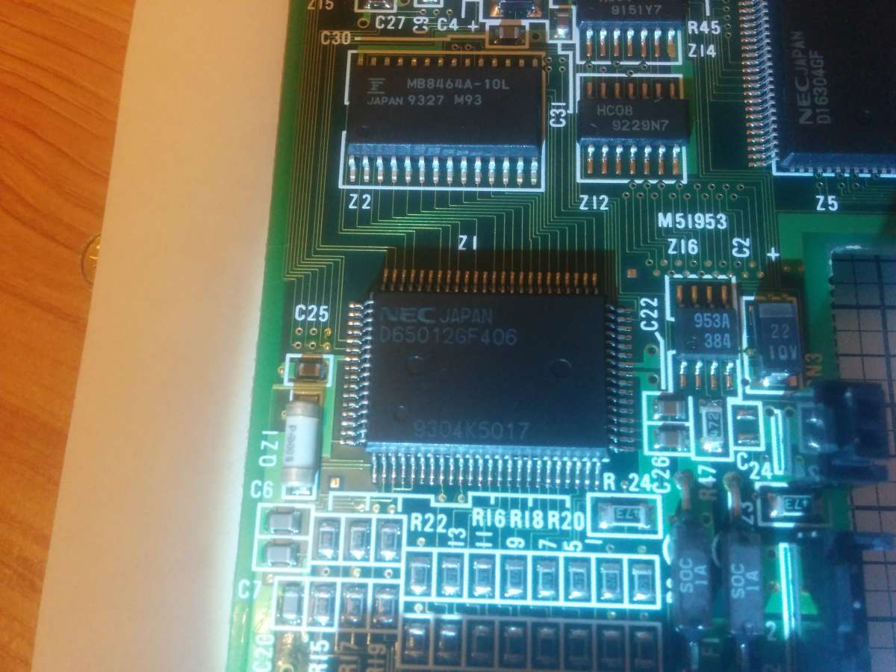
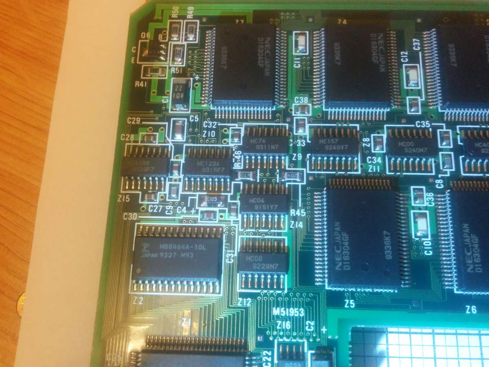
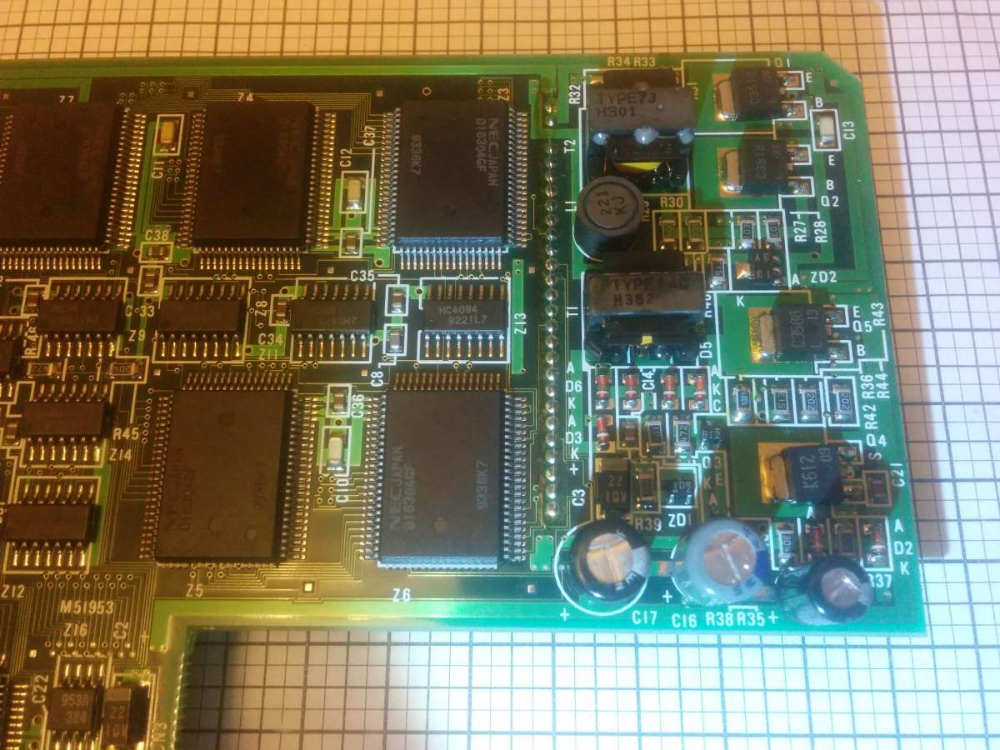

# Display FM70GX48AA-100A
This is a driver for AVR for two-lamp VFD graphic display (one: dot-matrix 70x48, other: icons).
Code compiled under **Atmel** Studio 7 .

In **Datasheet** u'll find description about the display, and in other directory you can get driver code.

Video with test: https://www.youtube.com/watch?v=Pww-wm7cSf0

## Photos

 
 
 
 

